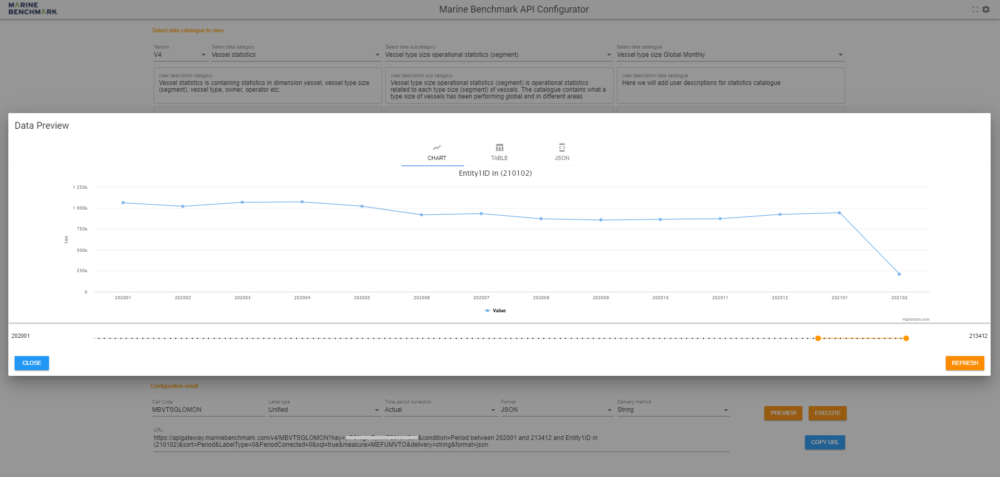

************************************************
Generic API
************************************************

Structure
================================================

API Catalogue Structure
------------------------------------------------

Datasets are reached by a (typically) 11-characters **catalogue code** with the following structure. Example: ``MBVESGLOWEK``

+--------------+-------------------------------+--------------------------+
| Code         | Full name                     | Specification            |
+==============+===============================+==========================+
| ``MB``       | Marine Benchmark              | Provider                 |
+--------------+-------------------------------+--------------------------+
| ``VES``      | Vessel operational statistics | Category and subcategory |
+--------------+-------------------------------+--------------------------+
| ``GLO``      | Global                        |                          |
+--------------+-------------------------------+    Catalogue             |
| ``WEK``      | Weekly                        |                          |
+--------------+-------------------------------+--------------------------+

The two first letters are always ``MB`` in the generic API, the next 3 charactersspecifies the combination of category and subcategory (``VES``), and the next 6 charactersspecifies catalogue (``GLOWEK – Global weekly``)

API Measurement Structure
------------------------------------------------

Measurements are specified by a (typically) 8-character **measurement code**. The structure may vary but measurement concerning vessel statistics typically have the following structure.
Example: ``SPEEDSTLO``

.. list-table:: 
    :width: 70%
    :header-rows: 1

    * - Code 
      - Full name 
      - Specification
    * - ``SPED``
      - Speed
      - Measurement
    * - ``ST``
      - Steaming
      - Vessel State
    * - ``LO``
      - Loaded
      - Vessel Condition

`Multi-measurements` are supported since **API V4** and are to be specified as a parameter. 

.. Available catalogues and corresponding measures for vessel statistics can be found in `References`_

Web Based API Configurator
================================================

General
------------------------------------------------

For developers convenience Marine Benchmark has developed a `web based configurator`_ where you can build URL calls and arguments.
This is a graphical user interface to construct and configure generic API calls. The configurator lets you choose category, subcategory, catalogue with multiple data parameters and conditions to construct powerful API calls.

Configurator URL
------------------------------------------------

The API configurator can be accessed from the following URL. It is used to browse available data and dynamically construct API URLs.
https://graphicalobjectlibrary.marinebenchmark.com/apiconfigurator/

.. _web based configurator: https://graphicalobjectlibrary.marinebenchmark.com/apiconfigurator/

Authentication
------------------------------------------------

First time visiting the API configurator page you will be asked to enter your credentials in form of an **API key**.

.. image:: _static/images/key.png
  :width: 100%
  :alt: configurator-page

These options can be changed anytime by selecting the **Settings** button in the topright corner.

Constructing API Call
------------------------------------------------

Next, you will be redirected to the API Configurator page which contains three sections.

1.  **Catalogue and measure selection** 
        Here you are required to select category, subcategory, catalogue and
        measures in the listed order. Brief description of each selection can be seen under the drop-down menu. These
        fields are searchable.

2.  **Data selection**
        Here you are required to specify the data selection, typically **Entity1ID**. Optional parameters also include *aggregate by*, 
        *aggregation type*, *top number of records* and *sort order*, which can be enabled/disabled depending on the selection in (1)
        *Catalogue and Measure selection*. You can also select the period by sliding the timeline. A valid Entity1ID
        depends on the selected data category and subcategory, and can consist of a single IMO number, list of IMO
        numbers, type size ID and more.

3.  **Result configuration** 
        Here you can change the response value label, period correction and delivery format and method. The
        constructed API URL call is generated at the bottom and the result can be executed directly or previewed. The
        preview button enables you to see the results in multiple formats, such as a plain JSON, table or even as a graph if
        possible.

Example Queries
------------------------------------------------

1.  Single-measure selection (Speed steaming)
################################################

Say we are simply interested in the **daily** speed of a vessel, in this case :blue:`OLJAREN(9236315)`. We begin by selecting the appropriate category and subcategory.

**Category**: :green:`Vessel statistics`

**Subcategory**: :green:`Vessel operational statistics`

We are interested in the daily statistics catalogue.

**Catalogue**: :green:`Vessel Global Daily`

We only want the vessel speed in *steaming condition* (+6 kn). By searching for ‘speed steaming’ in the measure field we
find three matching results. **Speed steaming total**, **Speed steaming loaded** and **Speed steaming unloaded**. Since we do not
care about the vessel loaded or unloaded condition, we select **Speed steaming total**.

**Measure(s)**: ``SPEEDSTTO - Speed steaming total``

For data selection we specify that we are interested in the entity :blue:`OLJAREN(9236315)` by setting the state condition in SQL
format as ``Entity1ID in (9236315)``, and leave the rest of the fields empty, as we are not interested in an aggregated result.
Do not forget to specify the period by sliding the timeline.

The API URL is dynamically constructed and can be copied, executed directly in browser, or previewed at the bottom of the
page

.. image:: _static/images/ex1-data .png
  :width: 90%
  :align: center

2.  Multi-measure selection (|CO2| Emission)
################################################
 

Say we are interested in the **weekly** |CO2| emission of a vessel, in this case :blue:`SEAWAYS TANABE (9196632)` for both loaded
and unloaded condition. Begin by selecting the appropriate category and subcategory for single vessel statistics.

**Category**: :green:`Vessel statistics`

**Subcategory:** :green:`Vessel operational statistics`

We are interested in the weekly statistics catalogue.

**Catalogue**: :green:`Vessel Global Weekly`

We search for |CO2| in the measure field and find multiple matching result. A brief description is available under the field. We
specify that we are interested in main engine (ME) |CO2| emission for both loaded & unloaded condition.

**Measure(s)**: :green:`COMEMVLO - CO2 emission main engine moving loaded` and :green:`COMEMVUL - CO2 emission main engine moving unloaded`. We also include the selected measure from example 1. 

For data selection we need to specify that we are interested in the entity :blue:`SEAWAYS TANABE(9196632)` by setting the state
condition in SQL Server format as ``Entity1ID in (9236315)``, and leave the rest of the fields empty, as we are not interested
in an aggregated result.

Do not forget to specify the period by sliding the timeline.

.. image:: _static/images/ex2.png
  :width: 90%
  :align: center

The API URL is dynamically constructed and can be copied, executed directly in browser, or previewed at the bottom of the
page. Here the query is executed directly in browser to return a JSON string.

.. literalinclude:: _static/json/ex2.json
   :language: json

3.  Type size (Fuel consumption)
################################################

Say we are interested in the monthly fuel consumption (main engine) of a vessel type size, in this case :blue:`Tanker/VLCC -
200'-329.9' dwt` (210102). The type size ID can be found in .
.. :: FIX THIS REFERENCE ABOVE 

We begin by selecting the appropriate category and subcategory for vessel type size statistics.

**Category**: :green:`Vessel statistics`

**Subcategory**: :green:`Vessel type size operational statistics (segment)`

We are interested in the monthly statistics catalogue.

**Catalogue**: :green:`Vessel type size Global Monthly`

We search for fuel in the measure field and find multiple matching result. A brief description is available under the field. We
specify that we are interested in main engine (ME) fuel consumption in moving state (+1 kn), independent of vessel
conditions (loaded/unloaded).

**Measure(s)**: :green:`MEFUMVTO - ME fuel moving total`

For data selection we need to specify that we are interested in the type size entity :blue:`Tanker/VLCC - 200'-329.9' dwt`  by 
setting the state condition in SQL Server format as ``Entity1ID in (210102)``, and leave the rest of the fields
empty, as we are not interested aggregating the result further.

Do not forget to specify the period by sliding the timeline.

.. image:: _static/images/ex3.png
  :width: 90%
  :align: center

The API URL is dynamically constructed and can be copied, executed directly in browser, or previewed at the bottom of the
page. Here the query is previewed to be displayed as a graph. 

4. Distributions (Water temperature)
###############################################

Distribution statistics are very powerful and are available from the Vessel distributions and Vessel type size distributions
subcategory. These contains vessel distribution curves for various parameters such as speed, draft, water temperature and
more. 

We want the **distance** and **time spent** in various **water temperature** for a specific vessel or vessel type size.
For example: ``Monthly Water temperature (WT5MON)`` for the VLCC tanker :blue:`PERFECT (9241114)`

**Category**: :green:`Vessel statistics`

**Subcategory**: :green:`Vessel distributions`

**Catalogue**: :green:`Monthly Water temperature`

**Measure(s)**: :green:`TIMEDITO – Time distributed total, DISTDITO – Distance distributed total`

State condition in SQL server format: ``Entity1ID in (9241114)``

Resulting API URL after specifying period between 2020-06 and 2020-08: :: 

    https://apigateway.marinebenchmark.com/v4/MBVEDWT5MON?key=xxxxxxxxxxx&condition=Period%20between%20202006%20and%20202008%20and%20Entity1ID%20in%20(9241114)&sort=Period&LabelType=1&PeriodCorrected=0&sql=true&measure=TIMEDITO,DISTDITO&delivery=string&format=json 

The distribution dimension for water temperature is here discretized with 0.5 °C increments. This may vary between different distributions. 

.. literalinclude:: _static/json/watertemp.json
    :language: json

  
5. Distributions per type size (Speed)
################################################

Since distribution statistics also are available per type size (segments), here is another example for speed distribution for
:blue:`01 Tanker / B VLCC - 200'-329.9' dwt`. The type size IDs can be found in (..).

We repeat the same process of choosing correct category, subcategory, and catalogue. For measures we again
want both time spent and distance traveled.

Category: :green:`Vessel statistics`

Subcategory: :green:`Vessel type size distributions (segment)`

Catalogue: :green:`Monthly Speed05`

Measure(s): :green:`TIMEDITO – Time distributed total, DISTDITO – Distance distributed total`

State condition in SQL server format: ``Entity1ID in (210102)``

Resulting API URL after specifying period 2020-06: :: 

    https://apigateway.marinebenchmark.com/v4/MBVDTSP5MON?key=xxxxxxxxxxxxxxxx&condition=Period%20between%20202006%20and%20202006%20and%20Entity1ID%20in%20(210102)&sort=Period&LabelType=1&PeriodCorrected=0&sql=true&measure=TIMEDITO,DISTDITO&delivery=string&format=json

The distribution dimension for speed is discretized with 0.5 knot increments.

.. literalinclude:: _static/json/ts-speed.json
    :language: json

6.  Area (..)
################################################

.. note::
  TBD..

.. DO NOT REMOVE 
.. |CO2| replace:: CO\ :sub:`2`\